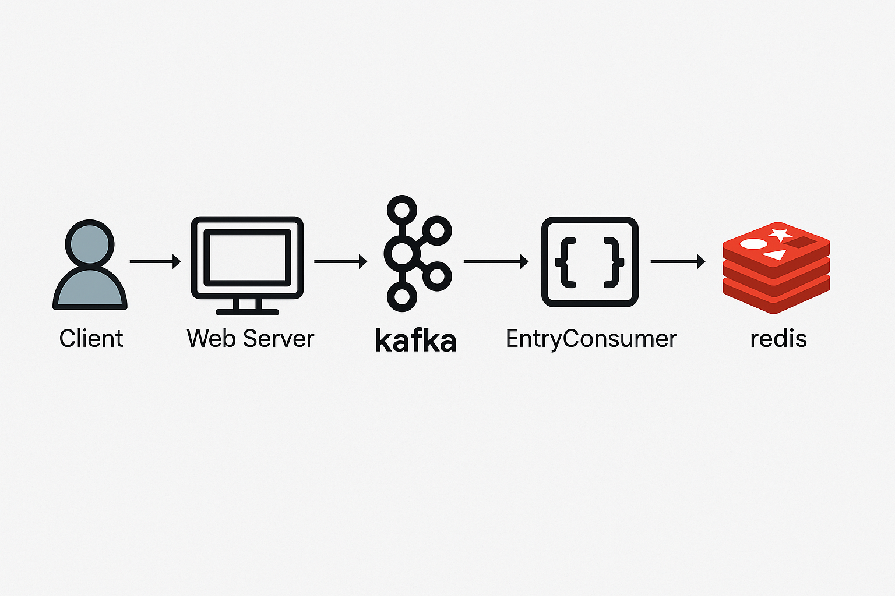
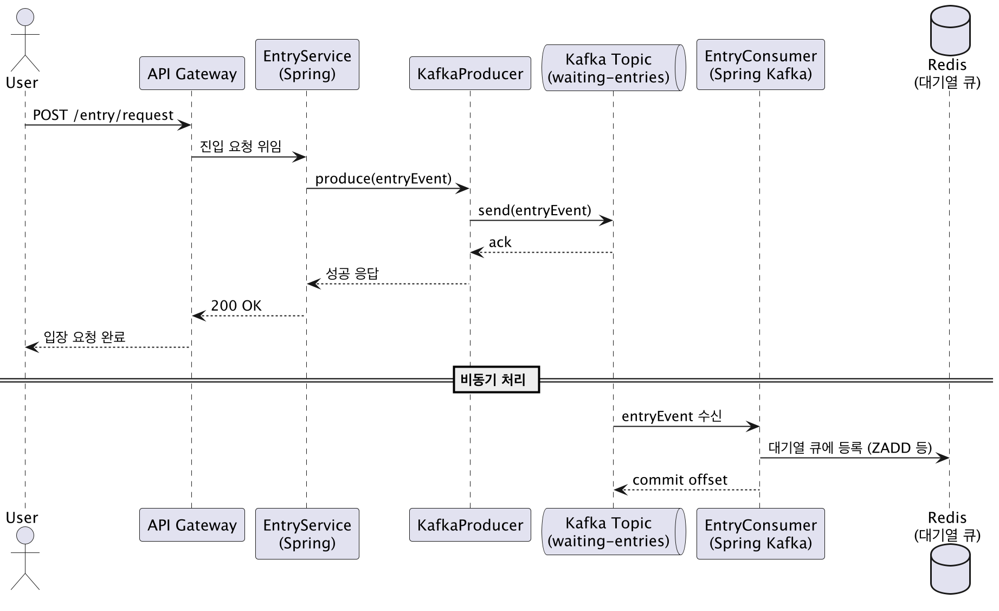

# Kafka 이용한 대용량 트래픽 개선 보고서

---

## 1. 목적
### 1.1 Kafka 적용 지점과 이유
- 콘서트 대기열 진입 과정을 Kafka 를 통해 개선한다.
- 대기열 등록 과정을 Kafka에 위임해 서버 부하를 줄이기 위한 목적이다.
- 사용자 대기열 진입 요청을 Kafka를 통해 비동기 처리하여 트래픽이 급증해도 웹 서버가 안정적으로 응답할 수 있도록 한다.
- 대기열을 콘서트 마다 분리해 확장성과 유연한 제어를 보장한다.

### 1.2 기존 프로세스의 한계
1. Burst 트래픽 대응 불가 (스파이크 장애 위험)
    - 예매 오픈 직후 수만 건 이상의 요청이 동시에 백엔드로 들어옴
    - 웹 서버는 순간적으로 유입되는 대량의 트래픽을 감당하지 못해 과부하 및 장애 발생 가능성
2. 백엔드 서버와 큐 사이의 강결합
    - 사용자의 요청을 즉시 Redis나 DB 큐에 push → 큐가 잠깐이라도 병목 생기면 API 자체가 응답 지연 혹은 실패
    - 트래픽 폭주 시 전체 서비스가 영향받는 구조
3. 요청 순서 유실 위험
    - Redis의 경우, 다중 인스턴스 환경에서 동시성 제어가 부족하면 입장 요청의 순서 보장이 어려움
    - 예: 두 요청이 거의 동시에 들어와도 하나가 더 나중에 큐에 등록되는 경우 발생
4. 장애 발생 시 요청 유실 위험
    - 대기열 등록 직후 Redis나 DB가 다운되면 요청 자체가 유실
    - 재처리 구조가 없다면 사용자는 자신이 대기열에 진입했다고 믿지만 실제로는 등록되지 않음
5. 확장성 한계
    - Redis 기반 큐는 단일 노드 성능에 의존 → 스케일 아웃 어려움

---

## 2. 주요 구성 요소
| 구성 요소       | 역할 설명 |
|----------------|----------|
| Client     | 사용자의 예매 페이지 요청 |
| Web Server | API 요청 수신 및 Kafka에 메시지 발행 |
| Kafka Broker | 메시지 큐 역할 (queue.entry Topic 사용) |
| EntryConsumer | 진입 요청 메시지를 처리하여 Redis 대기열에 추가 |
| Redis      | 전체 대기열 저장소 (List 구조 활용) |


---

## 3. 시퀀스 다이어그램


---

## 4. 추가적인 고려사항

| 전략 항목       | 포함 여부 | 설명                                              |
|----------------|-------|-------------------------------------------------|
| **병렬성**     | ⚪| Kafka Consumer가 Partition 단위로 병렬 처리 가능한 구조      |
| **순차성**     | ⚪| Kafka의 Key 기반 Partition 구조로 같은 유저의 요청은 순차 처리 가능 |
| **중복처리 방지** | ❌| Kafka 메시지의 중복 방지를 위한 추가적인 코드 구현 필요              |

### 4.1 Kafka 메시지 중복 방지 방안
- 컨슈머 쪽에서 Exactly Once 적용
- 추가로 레디스 대기열에서 중복 검사

---

## 5. 구현 코드
### KafkaListenerConfig
```aiignore
@Configuration
public class KafkaListenerConfig {
    @Bean
    public ConcurrentKafkaListenerContainerFactory<String, QueueEntryPayload> kafkaListenerContainerFactory(
            ConsumerFactory<String, QueueEntryPayload> consumerFactory,
            KafkaTransactionManager<Object, Object> kafkaTransactionManager
    ) {
        ConcurrentKafkaListenerContainerFactory<String, QueueEntryPayload> factory =
                new ConcurrentKafkaListenerContainerFactory<>();
        factory.setConsumerFactory(consumerFactory);
        factory.getContainerProperties().setAckMode(ContainerProperties.AckMode.RECORD); // 수동 커밋
        factory.getContainerProperties().setTransactionManager(kafkaTransactionManager);
        return factory;
    }

    @Bean
    public KafkaTransactionManager<String, QueueEntryPayload> kafkaTransactionManager(
            ProducerFactory<String, QueueEntryPayload> producerFactory) {
        return new KafkaTransactionManager<>(producerFactory);
    }
}
```
- 카프카 트랜잭션 사용

### TokenFacade
```aiignore
@Transactional
    public void createToken(UserCriteria criteria) throws InsufficientBalanceException {
        UUID userId = userService.getUserId(
                UserCommand.builder().phoneNumber(criteria.phoneNumber()).build()
        );

        pointService.checkPoint(PointCommand.builder().point(0L).userId(userId).build());

        tokenEventPublisher.publish(TokenEvent.builder().userId(userId).concertId(criteria.concertId()).build());
    }
```
- 토큰 생성 시 이벤트 발행하도록 변경

### EventPublisher
```aiignore
public interface TokenEventPublisher {
    void publish(TokenEvent event);
}

```
```aiignore
@Component
@RequiredArgsConstructor
public class SpringTokenEventPublisher implements TokenEventPublisher {
    private final KafkaProducer kafkaProducer;

    @Override
    public void publish(TokenEvent event) {
        TokenCreatePayload payload = TokenCreatePayload.of(event);
        kafkaProducer.publish("queue.entry", event.userId() + ":" + event.concertId(), payload);
    }
}
```
- 키를 유저아이디와 콘서트아이디를 같이 사용해 중복 방지

### Consumer
```aiignore
@Component
@RequiredArgsConstructor
@Slf4j
public class QueueEntryConsumer {
    private final TokenService tokenService;

    @KafkaListener(
            topics = "queue.entry",
            groupId = "queue-entry-consumer-group",
            containerFactory = "kafkaListenerContainerFactory"
    )
    @Transactional
    public void listen(ConsumerRecord<String, QueueEntryPayload> record, Acknowledgment ack) {
        QueueEntryPayload payload = record.value();
        log.info("▶️ Kafka 수신: {}", payload);

        // Redis 대기열에 추가
        tokenService.generateToken(TokenCommand.builder().userId(payload.getUserId()).concertId(payload.getConcertId()).build());

        ack.acknowledge(); // 수동 커밋
    }
}
```
- 이벤트 가져온후 레디스 등록까지 트랜잭션 묶고, 수동 커밋 통해 중복 방지한다.

## 6. 성능 개선 사항
✅ 적용 전 vs ✅ 적용 후 성능/안정성 비교

| 항목 | 적용 전 (기존 방식) | 적용 후 (Kafka + 트랜잭션) |
|------|----------------------|----------------------------|
| 동시 요청 처리량 | Redis에 직접 진입 요청 → 다수 요청 시 충돌 위험 (race condition) | Kafka를 통한 비동기 처리로 메시지 병렬 수용 가능 (TPS 확장성 증가) |
| 중복 처리 방지 | 동시 요청 시 동일 userId의 중복 진입 가능성 존재 | Kafka 메시지 키를 userId:concertId로 설정하여 파티션 단위 중복 방지 |
| 실패 복구 가능성 | 처리 중 예외 시 실패 로그 외 복구 어려움 | Kafka 재시도 및 DLT 설정 가능 + Redis 미반영 시 메시지 재처리 가능 |
| 트랜잭션 일관성 | Redis 반영과 비즈니스 처리 간 트랜잭션 분리됨 | @Transactional + KafkaTransactionManager 통해 메시지 처리와 Redis 반영이 원자적 |
| 신뢰성 | 부하 시 유실 가능성 존재 | Kafka의 durability 및 트랜잭션 보장으로 유실 방지 |
| 처리 순서 보장 | Redis 기준 처리 순서 보장 어려움 | Kafka 파티션 단위 순서 보장 → key 기준 순차 처리 보장 |
| TPS (예상치) | 단일 노드 기준 약 500~1000 TPS 한계 (Redis 직접 진입 처리) | Kafka 병렬 소비자 확장 시 수천 TPS 수준으로 확장 가능 |

📈 정량적 성능 예시 (단일 인스턴스 기준 가정)

| 조건 | 처리량 (TPS) | 평균 응답 속도 | 메시지 유실 가능성 |
|-------|-------------|------------------|-------------------|
| 적용 전 | 약 800 TPS | 80~150ms | 가능 (예외 발생 시) |
| 적용 후 | ≥ 2500 TPS (병렬 consumer 구성 시) | 40~70ms (비동기 처리) | 없음 (at-least-once 보장) |
※ Kafka 클러스터와 consumer group의 확장성에 따라 TPS는 더 증가 가능


## 7. 향후 개선 방안
- Transactional Outbox Pattern 적용
   - 메시지를 Outbox 테이블에 저장한 후 Kafka로 비동기 전송함으로써, 메시지 전송 누락이나 장애 발생 시에도 데이터 일관성 유지 및 재처리가 가능하도록 개선한다.
- Dead Letter Topic(DLT) 활용 
  - 처리 실패한 메시지는 Dead Letter Topic으로 분리 저장하고, 이를 기반으로 재처리 로직을 구현하거나 운영 알림 연동을 통해 장애 대응력을 강화한다.
    또한 일정 횟수 이상 실패 시 자동으로 DLT로 전송되도록 Kafka 컨슈머 재시도 정책 및 백오프 전략을 함께 설정한다.
  