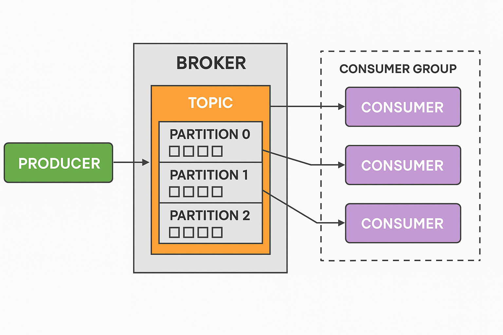
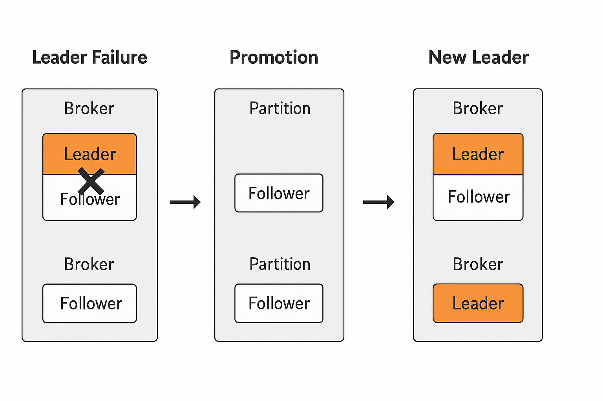

# Kafka 기초 개념 정리 문서

## 0. Kafka 세팅

### 스프링 Kafka 프로젝트 연동
```aiignore
	implementation ("org.springframework.kafka:spring-kafka")
```
---
### Kraft 이용한 docker compose 세팅
```aiignore
services:
  kafka-1:
    container_name: kafka-1
    image: confluentinc/cp-kafka:latest
    ports:
      - "9092:9092"
    volumes:
      - ./data/kafka-1:/var/lib/kafka/data
    networks:
      - kafka-net
    environment:
      KAFKA_NODE_ID: 1
      KAFKA_LISTENER_SECURITY_PROTOCOL_MAP: CONTROLLER:PLAINTEXT,INTERNAL:PLAINTEXT,EXTERNAL:PLAINTEXT
      KAFKA_ADVERTISED_LISTENERS: INTERNAL://kafka-1:29092,EXTERNAL://localhost:9092
      KAFKA_LISTENERS: INTERNAL://:29092,CONTROLLER://:29093,EXTERNAL://0.0.0.0:9092
      KAFKA_PROCESS_ROLES: "broker,controller"
      KAFKA_CONTROLLER_QUORUM_VOTERS: 1@kafka-1:29093,2@kafka-2:29094,3@kafka-3:29095
      KAFKA_INTER_BROKER_LISTENER_NAME: INTERNAL
      KAFKA_CONTROLLER_LISTENER_NAMES: CONTROLLER
      CLUSTER_ID: "clusterid"

  kafka-2:
    container_name: kafka-2
    image: confluentinc/cp-kafka:latest
    ports:
      - "9093:9093"
    volumes:
      - ./data/kafka-2:/var/lib/kafka/data
    networks:
      - kafka-net
    environment:
      KAFKA_NODE_ID: 2
      KAFKA_LISTENER_SECURITY_PROTOCOL_MAP: CONTROLLER:PLAINTEXT,INTERNAL:PLAINTEXT,EXTERNAL:PLAINTEXT
      KAFKA_ADVERTISED_LISTENERS: INTERNAL://kafka-2:29093,EXTERNAL://localhost:9093
      KAFKA_LISTENERS: INTERNAL://:29093,CONTROLLER://kafka-2:29094,EXTERNAL://0.0.0.0:9093
      KAFKA_PROCESS_ROLES: "broker,controller"
      KAFKA_CONTROLLER_QUORUM_VOTERS: 1@kafka-1:29093,2@kafka-2:29094,3@kafka-3:29095
      KAFKA_INTER_BROKER_LISTENER_NAME: INTERNAL
      KAFKA_CONTROLLER_LISTENER_NAMES: CONTROLLER
      CLUSTER_ID: "clusterid"

  kafka-3:
    container_name: kafka-3
    image: confluentinc/cp-kafka:latest
    ports:
      - "9094:9094"
    volumes:
      - ./data/kafka-3:/var/lib/kafka/data
    networks:
      - kafka-net
    environment:
      KAFKA_NODE_ID: 3
      KAFKA_LISTENER_SECURITY_PROTOCOL_MAP: CONTROLLER:PLAINTEXT,INTERNAL:PLAINTEXT,EXTERNAL:PLAINTEXT
      KAFKA_ADVERTISED_LISTENERS: INTERNAL://kafka-3:29094,EXTERNAL://localhost:9094
      KAFKA_LISTENERS: INTERNAL://:29094,CONTROLLER://kafka-3:29095,EXTERNAL://0.0.0.0:9094
      KAFKA_PROCESS_ROLES: "broker,controller"
      KAFKA_CONTROLLER_QUORUM_VOTERS: 1@kafka-1:29093,2@kafka-2:29094,3@kafka-3:29095
      KAFKA_INTER_BROKER_LISTENER_NAME: INTERNAL
      KAFKA_CONTROLLER_LISTENER_NAMES: CONTROLLER
      CLUSTER_ID: "clusterid"

networks:
  kafka-net:
    driver: bridge
```
---
### applicaion.yml Kafka 설정
```aiignore
spring:
  kafka:
    bootstrap-servers: 서버 호스트/포트들..
    properties:
      request.timeout.ms: 20000
      retry.backoff.ms: 500
      auto:
        create.topics.enable: false
        register.schemas: false
        offset.reset: latest
        # 컨슈머가 붙었을 때, 내가 원하는 곳부터 땡겨온다.
        # 처음 붙었을 때. ( 다시 붙었을 대. ) 어디부터? 를 결정해야함
        # latest : 최신 ( 앞의 못읽었던 메세지는 안 읽는다 )
        # earliest : 카프카에 적재되어있는 제일 오래된 메세지부터 ( 읽었던 메세지를 또 읽을 수도 있음 )
      use.latest.version: true
      basic.auth.credentials.source: USER_INFO
    producer:
      client-id: 프로듀서 ID 로 쓰일 값
      key-serializer: org.apache.kafka.common.serialization.StringSerializer
      value-serializer: org.springframework.kafka.support.serializer.JsonSerializer
      retries: 5
    consumer:
      group-id: 컨슈머 그룹 ID 로 쓰일 값
      key-deserializer: org.apache.kafka.common.serialization.StringDeserializer
      value-deserializer: org.apache.kafka.common.serialization.ByteArrayDeserializer
      properties:
        enable-auto-commit: false
    listener:
      ack-mode: manual # 수동으로 커밋하겠다.
      # acknowledge: Acknowledge 라는 객체를 파라미터로 받음 ( 카프카 리스너 함수에서 )
      # acknowledge.acknowledge() // 요 함수를 호출하면, 그 때 명시적으로 커밋을 날리겠다.
```
- create.topics.enable: false
  - Kafka가 요청한 Topic이 없을 경우 자동으로 생성하지 않도록 설정.
  - 운영환경에서는 안정성과 제어를 위해 보통 false.
   

- register.schemas: false
  - (Schema Registry 사용 시) Producer가 Schema를 자동 등록하지 않도록 설정.
  - 데이터 포맷에 대한 통제를 위해 유용.   
   

- offset.reset: latest
  - 컨슈머가 처음 시작하거나 offset 정보가 없을 경우 어디부터 읽을지 결정.
    - latest: 가장 최근 메시지부터 읽음 (이전 메시지는 안 읽음).
    - earliest: 가장 오래된 메시지부터 읽음 (재처리 용도에 적합).
   

- use.latest.version: true
  - 라이브러리나 스키마 사용 시 최신 버전을 자동으로 참조하도록 지정.

- producer:group-id
  - producer 식별 아이디 지정
  - 로그에서 어떤 클라이언트가 메시지를 전송했는지 확인시 사용
  - 분산 시스템에서 트래픽 모니터링, 디버깅 시 사용
- producer:key-deserializer
  - 카프카 메시지의 키 값을 어떻게 역직렬화 할지 설정
  - StringDeserializer: 키를 문자열로 변환
  - 키는 일반적으로 메시지의 그룹핑 기준에 사용한다.
- producer:value-deserializer
  - 카프카 메시지의 value 값을 어떻게 역직렬화 할지 설정
  - JsonDeserializer: 키를 JSON 타입으로 변환 ( 내부적으로 Jackson 사용)
- producer:retries
  - 메시지 전송 실패시 자동 재시도 횟수
  - 네트워크 오류, 일시적 브로커 장애시 유용

- consumer:group-id
  - 컨슈머 그룹 아이디 지정
  - 같은 그룹 아이디 가진 컨슈머들은 카프카로부터 메시지를 분산 처리 한다.
  - 카프카는 하나의 파티션은 하나의 컨슈머에게만 할당되로고 보장한다.
- consumer:key-deserializer
  - 카프카 메시지의 키 값을 어떻게 역직렬화 할지 설정
  - StringDeserializer: 키를 문자열로 변환
- consumer:value-deserializer
  - 카프카 메시지의 value 값을 어떻게 역직렬화 할지 설정
  - ByteArrayDeserializer: 키를 바이트 배열로 변환
- consumer:properties.enable-auto-commit
  - Kafka 메시지 offset 자동 커밋 여부
  - 수동 커밋 써야 하는 이유
    - 메시지 처리 중 에러 발생 시 커밋하지 않고 다음에 다시 처리 가능
    - 정확한 메시지 처리를 위해 매우 중요하다.
---
## 1. Kafka 구성요소 설명

### 1.1 Broker
- Kafka 클러스터를 구성하는 서버 단위.
- Producer의 메세지를 받아 offset 지정 후 디스크에 저장
- Consumer의 파티션 Read에 응답해 디스크의 메세지 전송
- Consumer에게 데이터를 전달함.
- 일반적으로 여러 개의 Broker가 하나의 클러스터를 구성하여 데이터 분산 저장 및 처리.
- 각 브로커는 특정 중앙 역할을 수행하기도 한다.   
  1. Controller   
     - Kafka 클러스터 전체를 조정하는 역할
     - Leader 파티션 관리
       - Kafka는 각 파티션에 대해 Leader와 Follower 를 가진다.
       - 모든 읽기/쓰기는 Leader 파티션을 통해 이뤄지며, Leader 브로커가 죽으면, Controller는 다른 브로커에 있는 Follower 파티션 중 하나를 새로운 Leader로 승격시킨다.
       

  2. Coordinator
     - Consumer Group 관리
     - Consumer Group 의 각 Consumer가 어떤 파티션 읽을지 할당한다.
     - Consumer 가 장애로 빠지거나 추가되면 Rebalance를 실행 해 할당을 다시 분배한다.
  

### 1.2 Topic
- 메시지의 논리적 분류 단위 (메시지 큐의 이름과 유사).
- 하나의 Topic은 여러 개의 Partition으로 구성될 수 있음.
- Producer는 특정 Topic으로 메시지를 전송하고, Consumer는 Topic을 구독함.
- 

### 1.3 Partition
- Topic의 실제 물리적 저장 단위.
- Partition을 나눔으로써 병렬 처리 및 분산 저장이 가능해짐.
- 메시지는 순서대로 Partition에 저장됨 .
- 각 파티션에 발행된 순서대로 컨슘하기 때문에 각 파티션은 순차처리를 보장한다. (단, Partition 간에는 순서 보장 X)
- 동시성 제어 관점에서, 동시에 처리되면 안되는 자원의 Id 등을 메세지 키로 설정하면 순차처리가 보장되면서 병렬 처리로 높은 처리량을 보장한다.
- Producer 에서 메세지를 발행 시, 저장될 Partition 을 선택하기 위해 메세지의 키 해시를 활용하며, 키가 없을 경우 균형 제어를 위해 Round-Robin 방식으로 메세지를 기록한다.
- Partitioner
  - 메세지 발행 시, 토픽의 어떤 파티션에 저장될 지 결정
  - Producer 에서 결정한다. 
  - 특정 메세지에 키가 있으면 키의 해시 값에 매칭되는 파티션에 데이터를 전송해 키가 같은 메시지를 다건 발행해도, 항상 같은 파티션에 메세지를 보관해 처리순서를 보장할 수 있다.

### 1.4 Producer
- Kafka에 데이터를 전송하는 주체.
- 메시지를 전송할 Topic과 Partition을 선택하여 전송함.
- Round-Robin, Key 기반 Hashing, Custom Partitioning 등의 전략으로 Partition을 선택할 수 있음.

### 1.5 Consumer
- Topic을 구독하여 메시지를 읽는 주체.
- 하나 이상의 Partition으로부터 메시지를 가져오며, Consumer Group을 통해 병렬 처리 가능.
- 메세지를 읽을 때마다 파티션 별 offset을 유지해 처리했던 메세지의 위치를 추적한다.
- CURRENT-OFFSET
  - 컨슈머가 어디까지 처리했는지를 나타낸다.
  - 동일한 메세지를 재처리하지 않고, 처리하지 않은 메세지를 건너뛰지 않도록 마지막까지 처리한 offset을 저장(커밋)해야한다.
  - 만약 오류나 문제 발생 시, 컨슈머 그룹 차원에서 `--reset-offsets`  옵션을 통해 특정시점으로 offset을 되돌릴 수 있다.

### 1.6 Consumer Group
- 여러 Consumer가 하나의 그룹으로 묶여 Topic을 병렬로 처리함.
- Kafka는 각 Partition을 하나의 Consumer에만 할당함으로써 중복 없는 데이터 처리를 보장함.
- 하나의 토픽에 발행된 메세지를 여러 서비스가 컨슘하기 위해 그룹을 설정한다.
  - ex) 하나의 주문완료 메세지를 결제서비스에서도, 상품서비스에서도 컨슘
- 보통 소비 주체인 Application 단위로 Consumer Group 을 생성, 관리한다.
- 같은 토픽에 대한 소비주체를 늘리고 싶다면, 별도의 컨슈머 그룹을 만들어 토픽을 구독한다.
- 파티션의 개수가 그룹 내 컨슈머 개수보다 적다면 잉여 컨슈머의 경우 메세지가 소비될 수 없음을 의미한다.

### 1.7 메시지
- 카프카에 취급하는 데이터 단위
- <키, 메시지> 형태로 구성

### 1.8 Rebalancing
- Consumer 그룹의 가용성, 확장성을 확보해주는 개념
- 특정 컨슈머에서 다른 컨슈머로 소유권을 이전한다.
- 리밸런싱 중에는 컨슈머가 메시지를 읽을 수 없다.
- Rebalancing Case
  1. 컨슈머 그룹 내 새 컨슈머 추가
  2. 컨슈머 그룹 내 특정 컨슈머 장애 등으로 중단
  3. Topic 내 새 파티션 추가

### 1.9 Cluster
- 고가용성 위해 여러 서버 묶어 구성
- 한 서버 장애 시 대응이 가능하다.
- 브로커가 증가할수록 메시지 수신,전달 처리량을 분산할 수 있어 확장에 유리하다.
- 동작중인 다른 브로커에 영향 없이 확장가능해, 트래픽 증가에 따른 브로커 추가가 쉽다.

### 1.10 Replication
- cluster 의 가용성을 보장하는 개념
- 각 파티션 의 Replica 두어 백업과 장애 극복 가능하다.
  - Leader Replica
    - 파티션 별 1개 존재
    - 모든 프로듀서, 컨슈머의 요청을 리더를 통해 처리하여 일관성을 보장한다.
  - Follower Replica
    - 리더 제외 레플리카
    - 단순히 리더 메시지 복제 및 백업
    - 리더 죽으면 팔로워 중 하나가 리더가 된다.
    - 리더의 메시지와 동기화 되지 않은 팔로워는 리더가 될 수 없다.
   

❕비동기 메시지 처리 주의점
  - 비즈니스 로직 실행 후 이벤트 미발행시, 해당 이벤트에 대응하는 Consumer 또한 본인의 비즈니스 로직 실행이 불가함으로 전체적인 비즈니스 흐름에 구멍이 생기거나 데이터 정합성에 문제가 생길 수 있다.

## 2. Producer, Partition, Consumer 수에 따른 데이터 흐름

### 2.1 Producer와 Partition
- 하나의 Producer는 여러 Partition으로 데이터를 보낼 수 있음.
- Partition 선택 전략:
  - **Round-Robin**: 순서대로 분산 전송
  - **Key 기반 Hashing**: 특정 키에 따라 고정 Partition 전송 → 메시지 순서 보장
  - **Custom**: 사용자 정의 전략으로 전송 Partition 결정

### 2.2 Partition과 Consumer 관계
- Kafka는 각 Partition을 한 Consumer에게만 할당함 (Consumer Group 단위 기준).
- **Partition 수 >= Consumer 수**:
  - 일부 Consumer는 여러 Partition을 할당받아 처리함.
- **Partition 수 < Consumer 수**:
  - 여분의 Consumer는 유휴 상태가 됨 (할당된 Partition 없음).

### 2.3 데이터 흐름 예시

#### 📘 케이스 1: Partition = 2, Consumer = 2, Producer = 1

```
Producer A ─┬──▶ Partition 0
            └──▶ Partition 1

Partition 0 ─▶ Consumer A  
Partition 1 ─▶ Consumer B
```

✅ 병렬 처리 OK  
✅ 각 Consumer는 하나의 Partition 담당

---

#### 📘 케이스 2: Partition = 2, Consumer = 3, Producer = 1

```
Producer A ─┬──▶ Partition 0
            └──▶ Partition 1

Partition 0 ─▶ Consumer A  
Partition 1 ─▶ Consumer B  
Consumer C ─❌ (할당 없음)
```

⚠️ 일부 Consumer는 할당되지 않음 → **리소스 낭비 가능성**

---

#### 📘 케이스 3: Partition = 3, Consumer = 2, Producer = 2

```
Producer A ─┬──▶ Partition 0
            ├──▶ Partition 1
Producer B ─┘        └──▶ Partition 2

Partition 0 ─▶ Consumer A  
Partition 1 ─▶ Consumer B  
Partition 2 ─▶ Consumer A
```

✅ 병렬 처리 가능  
⚠️ 일부 Consumer가 여러 Partition을 담당

---

#### 📘 케이스 4: Partition = 4, Consumer = 1, Producer = 1

```
Producer A ─▶ Partitions 0,1,2,3

Partition 0 ─┐  
Partition 1 ─┤  
Partition 2 ─┼──▶ Consumer A  
Partition 3 ─┘  
```

⚠️ 모든 Partition을 **한 Consumer가 처리** → 병목 발생 가능

---

#### 📘 케이스 5: Partition = 3, Consumer Group A: 2명, Consumer Group B: 2명

```
Producer A ─▶ Partitions 0,1,2

[Consumer Group A]
Partition 0 ─▶ Consumer A1  
Partition 1 ─▶ Consumer A2  
Partition 2 ─▶ Consumer A1

[Consumer Group B]
Partition 0 ─▶ Consumer B1  
Partition 1 ─▶ Consumer B2  
Partition 2 ─▶ Consumer B1
```

✅ **서로 다른 그룹은 독립적으로 소비** 가능  
✅ **한 메시지를 여러 그룹이 따로 소비 가능**

---

## 🧠 참고 정리

| 조건 | 결과 |
|------|------|
| Partition 수 < Consumer 수 | 일부 Consumer는 할당 없음 |
| Partition 수 > Consumer 수 | 일부 Consumer가 여러 Partition 담당 |
| Consumer Group 다름 | 메시지를 서로 독립적으로 처리 가능 |
| Producer 수 | 데이터 분산에 영향 적음 (Key와 Partition 전략이 핵심) |

### 2.4 병렬성과 확장성
- Partition 수가 많을수록 Consumer 수를 늘려 병렬 처리량 증가 가능
- 단, Partition 수는 설계 초기 결정 시 충분히 고려해야 함 (후에 변경은 복잡)

---

## 3 Kafka 이용한 예약 정보 이벤트 발행
### KafkaProducerConfig
```aiignore
@Configuration
public class KafkaProducerConfig {
    @Bean
    public ProducerFactory<String, Object> producerFactory() {
        Map<String, Object> config = new HashMap<>();
        config.put(ProducerConfig.BOOTSTRAP_SERVERS_CONFIG, "localhost:9092");
        config.put(ProducerConfig.KEY_SERIALIZER_CLASS_CONFIG, StringSerializer.class);
        config.put(ProducerConfig.VALUE_SERIALIZER_CLASS_CONFIG, JsonSerializer.class);
        config.put(JsonSerializer.ADD_TYPE_INFO_HEADERS, false); // 타입 정보 생략
        return new DefaultKafkaProducerFactory<>(config);
    }

    @Bean
    public KafkaTemplate<String, Object> kafkaTemplate() {
        return new KafkaTemplate<>(producerFactory());
    }
}
```
- 카프카 프로듀서 설정
   

### KafkaProducer
```aiignore
@Slf4j
@RequiredArgsConstructor
@Component
public class KafkaProducer {
    private final KafkaTemplate<String, Object> kafkaTemplate;

    public <T> void publish(String topic, String key, T payload) {
        try {
            kafkaTemplate.send(topic, key, payload)
                    .thenAccept(result -> log.info("✅ Kafka 메시지 전송 성공. topic={}, key={}, value={}, offset={}",
                            topic, key, payload, result.getRecordMetadata().offset()))
                    .exceptionally(ex -> {
                        log.error("❌ Kafka 메시지 전송 실패. topic={}, key={}, value={}, error={}",
                                topic, key, payload, ex.getMessage());
                        return null;
                    });
        } catch (Exception e) {
            log.error("❗ Kafka 전송 중 예외 발생. topic={}, key={}, value={}", topic, key, payload, e);
            throw e;
        }
    }
}
```
- 공통 카프카 프로듀서
- 
### PaymentEventListener
```aiignore
@Component
@RequiredArgsConstructor
public class PaymentEventListener {
    private final KafkaProducer kafkaProducer;

    @Async
    @TransactionalEventListener(phase = TransactionPhase.AFTER_COMMIT)
    public void paymentSuccessHandler(PaymentCompletedEvent event) {
        PaymentSuccessPayload payload = new PaymentSuccessPayload(event);
        kafkaProducer.publish("payment.success", event.paymentId().toString(), payload);
    }
}
```
- payment 이벤트 리스너에서 카프카로 이벤트 등록
- 외부 api에선 카프카에 등록된 메시지를 가져가면 된다.

## ✅ 정리
| 요소 | 설명 |
|------|------|
| Broker | Kafka 서버 노드, 데이터 저장 및 처리 |
| Topic | 메시지 분류 단위, 논리적 채널 |
| Partition | Topic의 물리적 저장 단위, 병렬 처리 단위 |
| Producer | 메시지를 Kafka로 전송하는 클라이언트 |
| Consumer | 메시지를 Kafka에서 읽는 클라이언트 |
| Consumer Group | Consumer 묶음, Partition 병렬 처리 담당 |

Kafka는 대규모 실시간 데이터 처리에 강력한 메시징 플랫폼으로, 분산성과 확장성 측면에서 우수한 구조를 가지고 있다.
